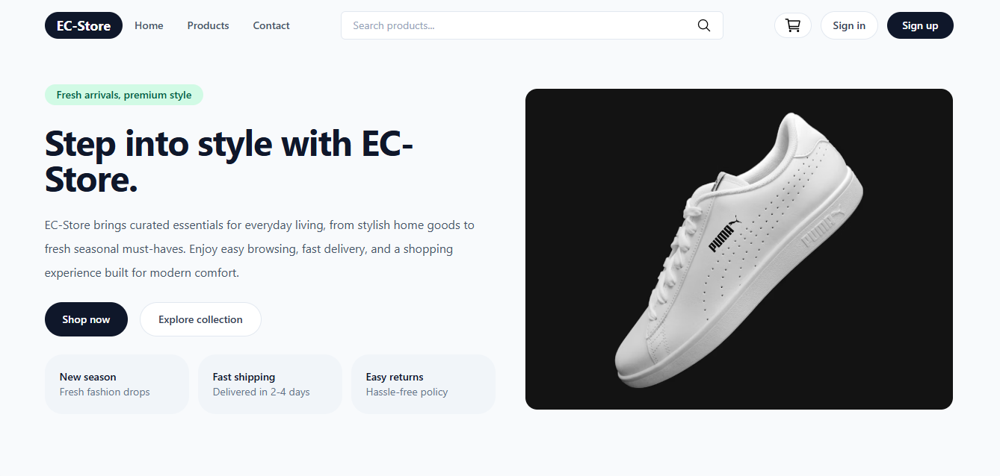
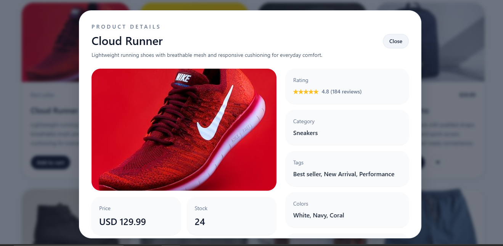
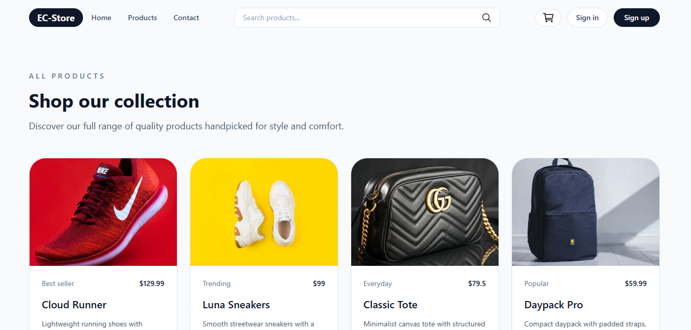
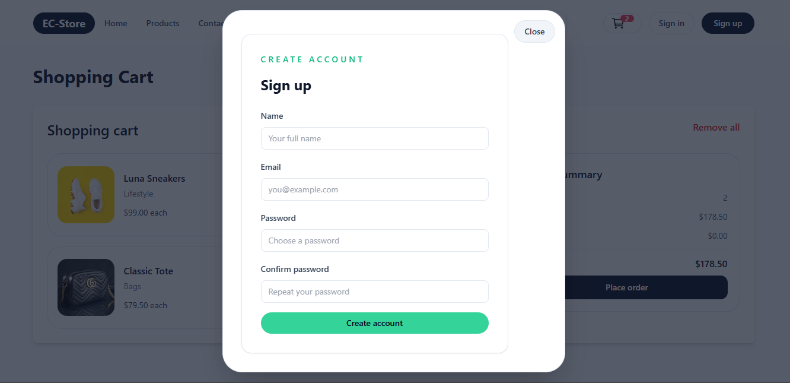
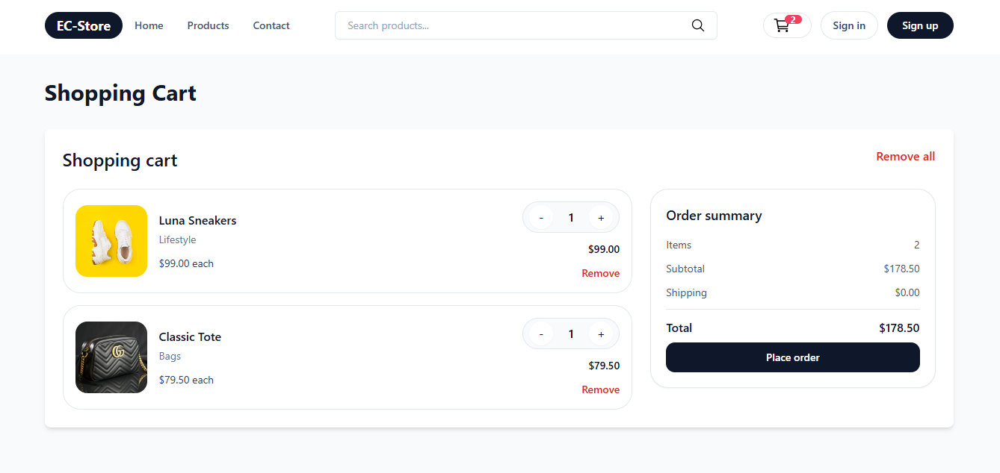

# 🛒 EC-Store

A modern e-commerce application built with React, featuring secure user authentication, real-time product search, cart management, and responsive design. The app focuses on performance, usability, and a seamless shopping experience across devices.

## ✨ Features

- 🔐 User Authentication (Sign Up & Login)
- 🔎 Search products
- ❤️ Add products to favorites
- 🛒 Shopping cart with quantity management
- 💰 Price calculation and order summary
- 📱 Fully responsive design
- 🎨 Modern UI with Tailwind CSS
- 💾 Persistent data using Local Storage
- ⚡ State management with Redux Toolkit
- 🚀 Client-side routing with React Router

---

## 📸 Screenshots

| Home                        | Product Details                       |
| --------------------------- | ------------------------------------- |
|  |  |

| products                        | Authentication              |
| ------------------------------- | --------------------------- |
|  |  |

| cart  
| ---------------------------
| 

---

## 🛠️ Built With

- React
- Redux Toolkit
- React Router
- Tailwind CSS
- JavaScript (ES6+)
- HTML
- CSS
- Local Storage
- Responsive design

---

## 📂 Project Structure

```
src/
│── assets/
│── components/
│── context/
│── data/
│── hooks/
│── styles/
│── pages/
│── store/
│── services/
│── utils/
│── App.jsx
└── main.jsx
```

---

## 🌐 Live Demo

**Demo:** https://ahmdgoud.github.io/EC-Store/#/

---

## 👨‍💻 Author

**Ahmed AbdelRahman**

- Portfolio: https://ahmdgoud.github.io/AhmedAbdelRahman/
- LinkedIn: https://www.linkedin.com/in/ahmed-abdelrahman-7ab52b231/
